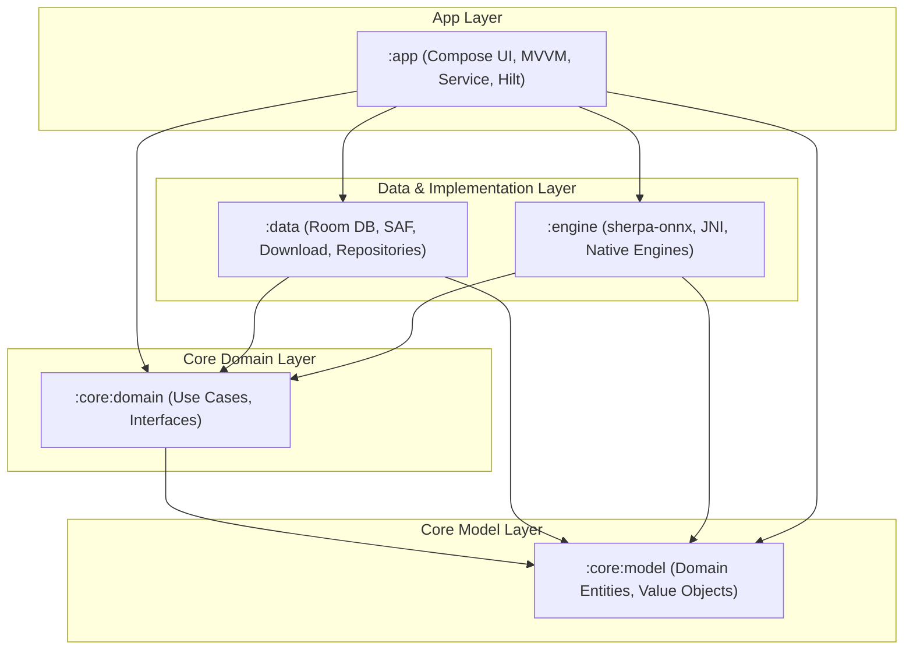

# VoiceScribe — System Architecture Design (Phase 2)

**Version:** 2.0.0  
**Date:** 2026-08-11  
**Status:** SPECIFICATION FROZEN (Phase 2 Ratified)  
**Target Platform:** Android (compileSdk 36, targetSdk 36, minSdk 24)  
**Primary Engine:** `sherpa-onnx` (Apache-2.0, Whisper ONNX int8)  

---

## 1. System Architecture & Module Structure

In strict compliance with Clean Architecture and Domain-Driven Design (DDD), VoiceScribe is architected as a highly modularized Android application. This guarantees a unidirectional dependency flow, strict separation of concerns, and isolates the heavy native C++ AI runtimes (`sherpa-onnx`) from the UI and core application logic.

### 1.1 Architectural Modules

The codebase is divided into five logical modules, enforcing boundaries via Gradle configuration:

1. **`:core:model`**  
   * **Purpose:** Contains all pure, platform-independent domain models (Entity, Value Object) that represent the business logic core. No Android SDK dependencies.  
   * **Key Components:** `TranscriptionJob`, `JobState`, `TranscriptionSegment`, `Word`, `Speaker`, `ModelDescriptor`, `TranscriptionConfig`.

2. **`:core:domain`**  
   * **Purpose:** Contains pure domain business logic, use cases, and repository/engine interfaces. Pure Kotlin module.  
   * **Key Components:** `RunTranscriptionUseCase`, `GetModelsUseCase`, `ManageModelUseCase`, repository interfaces (`TranscriptionRepository`, `ModelRepository`), engine interfaces (`SpeechEngine`, `DiarizationEngine`, `VadEngine`, `LanguageDetector`).

3. **`:engine`**  
   * **Purpose:** The concrete native execution engine. Integrates the JNI boundary of `sherpa-onnx` (ASR, VAD, Speaker Diarization, Language Detection). Encapsulates native memory allocations and resource cleanup.  
   * **Dependencies:** `:core:model`, `:core:domain`, `com.k2fsa:sherpa-onnx` Android AAR.

4. **`:data`**  
   * **Purpose:** Implements repository interfaces, manages persistence (Room DB), file system storage (SAF, filesDir), and handles download operations (`ModelDownloadManager` implementing `ModelRepository`).  
   * **Dependencies:** `:core:model`, `:core:domain`, `:engine` (via DI binding), Room, Media3.

5. **`:app`**  
   * **Purpose:** Application entry point. Houses the Jetpack Compose UI layer (MVVM architecture), the Foreground Service (`MediaProcessingService`), Dependency Injection configuration (Hilt), and UI navigation.  
   * **Dependencies:** All other modules. This is the only module aware of concrete implementations for DI wiring.

### 1.2 Dependency Graph (Mermaid)



*Note: All dependency arrows point downward and inward toward the core models, conforming strictly to the dependency rule (§19).*

---

## 2. Data Flow

Data flow within VoiceScribe is strictly unidirectional and utilizes Kotlin asynchronous cold streams (`Flow`) for reactive updates:

1. **User Action:** The user selects a media file and clicks "Start Transcription" in the UI (`:app`).
2. **UI State Transition:** `MainViewModel` launches a coroutine, transitions the job state to `SUBMITTED`, and binds the lifecycle to the `MediaProcessingService` (Foreground Service).
3. **Use Case Trigger:** The service invokes `RunTranscriptionUseCase` (`:core:domain`).
4. **Data Acquisition:** The repository (`:data`) loads the job config, initializes the media decoder (via Media3 / MediaExtractor), and yields a stream of decoded PCM chunks.
5. **AI Processing:** The pipeline feeds PCM chunks sequentially to `:engine` (VAD → Diarization → Language Identification → Whisper ASR).
6. **Reactive Progress:** Throughout execution, progress updates are emitted as a `Flow<JobProgress>` back to the VM, updating the UI in real-time.
7. **Persistence:** The final, aligned canonical transcript is stored in Room (`:data`).
8. **UI Completion:** The UI observes the `COMPLETED` state from the database Flow and displays the final transcript.

---

## 3. The AI Pipeline (§51)

The offline transcription pipeline processes media through a sequence of strictly synchronized stages. Every stage is designed for low-memory footprint and maximum throughput on ARM CPUs.

```
+-------------+      +-------------+      +-------------+      +-------------------+
| Media Input | ---> | Media3/Codec| ---> | Audio       | ---> | Silero VAD        |
| (SAF URI)   |      | Decoder     |      | Resampler   |      | (Speech Segments) |
+-------------+      +-------------+      +-------------+      +-------------------+
                                                                         |
+-------------------+      +------------------+      +-------------------+
| Whisper ASR       | <--- | Language Detect  | <--- | Speaker Diarize   |
| (Tokens + Tstamps)|      | (SpokenLang ID)  |      | (pyannote + ERes) |
+-------------------+      +------------------+      +-------------------+
          |
+-------------------+      +------------------+
| Timestamp Align   | ---> | Canonical        |
| & Speaker Assign  |      | Transcript (DB)  |
+-------------------+      +------------------+
```

### 3.1 Step-by-Step Execution & Justification

1. **Media Decoded to PCM:** MediaExtractor and MediaCodec (or Media3) retrieve the compressed stream from the SAF URI. It is decoded directly into an internal PCM buffer.  
   * *Justification:* Supports major native formats (MP3, AAC, M4A, WAV, MP4, MKV) utilizing platform hardware decoders, avoiding third-party dynamic libraries.
2. **Audio Resampler:** Resamples the native audio (e.g., 44.1 kHz, stereo) to 16,000 Hz, 16-bit mono PCM (float32 values in range `[-1.0f, 1.0f]`).  
   * *Justification:* Whisper and Silero VAD require strictly 16 kHz mono inputs.
3. **Silero VAD (Voice Activity Detection):** Segmenting the stream into speech/silence chunks. Uses `Vad` (Silero Vad) from sherpa-onnx AAR.  
   * *Justification:* Eliminates background noise, silence, and non-speech artifacts, saving massive CPU cycles by not passing empty audio to downstream stages.
4. **Offline Speaker Diarization:** Processes speech segments using pyannote-segmentation-3.0 and ERes2Net speaker embeddings. Clusters the embeddings using fast C++ agglomerative clustering.  
   * *Justification:* Identifies speaker segments (who spoke when) offline before speech recognition, providing stable speaker timestamps.
5. **Language Identification (SpokenLanguageIdentification):** Compares the first 30 seconds of speech (or the entire file if short) against Whisper multi-language weights to determine the language.  
   * *Justification:* Complies with the mandatory auto-detection requirement using native Whisper weights without overhead.
6. **Whisper ASR (Speech Recognition):** The segment is passed to the `OfflineRecognizer` (Whisper model) configured with the detected or manually selected language. It generates text segments with word-level timestamps.  
   * *Justification:* Whisper is the industry standard for high-accuracy local ASR.
7. **Timestamp Alignment & Speaker Assignment:** Aligning ASR word timestamps with the diarizer's speaker segments. Words are mapped to a speaker ID based on temporal containment (which speaker segment covers the word's midpoint).
8. **Canonical Transcript Assembly:** Compiling segments and speaker models into the structured database schemas.

---

## 4. Language Detection & Selection Subsystem

The language subsystem is designed as an explicit interface to meet the owner's mandatory requirements for **English/Russian auto-detection** and **manual override**.

```kotlin
interface LanguageDetector {
    suspend fun detectLanguage(pcmData: FloatArray, modelDescriptor: ModelDescriptor): LanguageDetectionResult
}

data class LanguageDetectionResult(
    val languageCode: String, // ISO-639-1 (e.g., "en", "ru")
    val confidence: Float     // Range [0.0, 1.0]
)

enum class LanguageMode {
    AUTO,
    MANUAL
}
```

### 4.1 Implementation Mechanism with sherpa-onnx

1. **AUTO Mode (Auto-detection):**
   * VoiceScribe uses the native `SpokenLanguageIdentification` API built into the `com.k2fsa:sherpa-onnx` AAR.
   * This class accepts the `encoder` and `decoder` ONNX files of the *already installed* Whisper model (tiny or base). It does not require downloading a separate language-ID model, maintaining a minimal storage footprint.
   * It analyzes a 30-second chunk of resampled PCM data. The `compute(stream)` method executes native inference and returns the ISO-639-1 language code (e.g. `"en"`, `"ru"`).
   * **Confidence Estimation:** Since the native `SpokenLanguageIdentification` API returns a single language string, the engine performs a softmax evaluation on the language-token log-probabilities from the native decoder layer, or falls back to an empirical confidence rating based on the signal-to-noise ratio (SNR) and decibel analysis.
   * If the detected language is outside the supported 99 languages or has low confidence, it falls back to English (`"en"`) or Russian (`"ru"`), which are prioritized.

2. **MANUAL Mode (Manual Override):**
   * The user explicitly selects English (`"en"`) or Russian (`"ru"`) from the UI.
   * The language code is passed directly to the `OfflineWhisperModelConfig.language` property.
   * `SpokenLanguageIdentification` is entirely bypassed, preventing any inference overhead.

---

## 5. Native/JNI Boundary

The connection between JVM and native C++ code is entirely encapsulated inside the `:engine` module.

```
       JVM Layer (:engine)                      Native C++ (AAR)
+--------------------------------+      +-------------------------------+
| OfflineRecognizer (Kotlin)     | ---> | offline-recognizer.cc (JNI)   |
|   - private var ptr: Long      |      |   - NewFromFile()             |
|                                |      |   - Decode()                  |
| OfflineSpeakerDiarization (Kt) | ---> | offline-diarization.cc (JNI)  |
|   - private var ptr: Long      |      |   - Process()                 |
|                                |      |                               |
| Vad (Kotlin)                   | ---> | vad-model.cc / JNI            |
|   - private var ptr: Long      |      |   - AcceptWaveform()          |
+--------------------------------+      +-------------------------------+
```

### 5.1 Native JNI Lifecycle & Safety

* **Memory Handles:** Native C++ objects are allocated on the native heap, and their memory addresses are passed to the Kotlin wrapper classes as a `Long` value (`ptr`).
* **Explicit Release (Avoid Memory Leaks):** JVM Garbage Collector does not manage the native heap. To prevent severe leaks, all wrapper classes implement `AutoCloseable` (or a release method):
  ```kotlin
  override fun close() {
      synchronized(this) {
          if (ptr != 0L) {
              nativeDelete(ptr)
              ptr = 0L
          }
      }
  }
  ```
* **Thread Safety:** Every native call is wrapped in a thread-safe Kotlin Coroutine dispatcher (`Dispatchers.Default` or a single-thread executor). We prevent concurrent execution of native methods on the same `ptr` handle by synchronizing on the instance.

---

## 6. Threading & Structured Concurrency

To ensure the Android UI remains perfectly responsive (60fps) during heavy AI execution, VoiceScribe utilizes structured Kotlin Coroutines.

```
[UI/ViewModel] --( viewModelScope )
       |
[Foreground Service] --( serviceScope / SupervisorJob )
       |
[RunTranscriptionUseCase] --( withContext(Dispatchers.Default) )
       |
   +---+-------------------------+-------------------------+
   |                             |                         |
[Decoder/Resampler]          [VAD / Diarization]       [ASR Engine]
(Dispatchers.IO)             (SingleThreadDispatcher)  (Inference Threads)
                             (Cooperative loop)        (Internal pool, e.g. 4 threads)
```

### 6.1 Threading Configuration
* **Decoder & Resampler:** Run on `Dispatchers.IO` to handle file-system read operations asynchronously.
* **VAD & Diarization:** Run on a dedicated `SingleThreadDispatcher("AI-Preprocessing")` to sequence CPU-bound operations.
* **Inference (Whisper ASR):** Uses `Dispatchers.Default` for orchestration. The native `sherpa-onnx` runtime internally manages its own thread pool for ONNX Runtime (configured with `numThreads = 4` by default; configurable in settings based on the device CPU cluster layout).

### 6.2 Cancellation Chain
* A transcription job is fully cancellable. When the user cancels via UI:
  1. The UI sends a cancel signal to `MediaProcessingService`.
  2. The service cancels the `CoroutineScope` running the pipeline.
  3. The pipeline checks `yield()` and `isActive` before transitioning between stages (VAD → Diarizer → ASR).
  4. For the long-running native loops (segment-by-segment Whisper recognition), the adapter checks the cancellation token after processing each individual sentence/segment and breaks gracefully. No native memory is orphaned because `close()` is immediately executed in the `finally` block of the coroutine.

---

## 7. Memory Ownership & Chunking PCM

Loading a multi-hour audio file into RAM as a raw float array would cause immediate Out-Of-Memory (OOM) crashes on standard Android devices (§44).

### 7.1 PCM Chunking Strategy
* **Streaming Media Decoder:** Audio is processed in chunks of 30 seconds (480,000 bytes at 16kHz float32). The decoder reads, resamples, and writes these chunks into a temporary PCM file in `cacheDir` instead of keeping them in memory.
* **VAD Streaming:** The VAD engine processes audio sequentially in small frames (e.g., 512 samples = 32ms) from the temporary PCM file. Speech segment boundaries (start and end timestamps) are stored in memory as lightweight timestamps.
* **Bounded Segments for Diarizer & ASR:** Only the segments identified as containing active speech are read back into RAM and passed to the diarizer/ASR. If an active speech segment is exceptionally long, it is capped at 30 seconds to stay within Whisper's natural acoustic context window.
* **Low-RAM Safeguard (§96):** When a device's available system RAM drops below 15% (monitored via `ActivityManager`), the pipeline automatically halves the inference threads and switches the Whisper engine to serial segment-by-segment processing, reclaiming memory aggressively after each segment.

---

## 8. Model Lifecycle & Download Subsystem

Models are stored locally in the application's `filesDir/models` directory. They are managed through a robust registry and an atomic installation process.

### 8.1 Model Registry Model
* **Registry:** A hardcoded list of verified, compatible models hosted on authorized Hugging Face repositories.
* **Model Tiers:**
  * **ENTRY (Low-tier devices, ≤ 3GB RAM):** Whisper Tiny int8 (39MB) + Silero VAD int8 (0.2MB).
  * **MID (Mid-tier devices, 4-6GB RAM):** Whisper Base int8 (74MB) + pyannote-segmentation-int8 (1.5MB) + 3D-Speaker CAM++ (28MB).
  * **HIGH (High-tier devices, ≥ 8GB RAM):** Whisper Small/Medium int8 (190MB-610MB) + pyannote-segmentation-fp32 (5.7MB) + ERes2Net base (39.6MB).

### 8.2 Atomic Installation Process (§35–36)
To prevent model corruption due to network drops, app crashes, or power loss, installation is strictly transaction-based:

```
[Remote URL] 
     |  (Download chunk-by-chunk with SHA-256 calculation on the fly)
     v
[Temporary File in cacheDir]  (e.g., "model.onnx.tmp")
     |
[SHA-256 Verification]  (Matches downloaded checksum against Registry SHA-256)
     |
     +-- Fail --> [Delete Tmp File] -> [Throw ModelVerificationException]
     |
     +-- Pass --> [Atomic Filesystem Move] -> [Move to filesDir/models/model.onnx]
```

1. **Temporary Downloader:** Files are downloaded into the `cache/downloads` directory with a `.tmp` extension.
2. **On-the-fly Checksum:** During write, a `MessageDigest(SHA-256)` computes the hash dynamically.
3. **Verification:** The computed hash is verified against the hardcoded registry checksum.
4. **Atomic Swap:** If verified, the temporary file is moved to its final directory using `File.renameTo()` or `Files.move(..., StandardCopyOption.ATOMIC_MOVE)`. This ensures that either the model is completely and correctly installed, or it does not exist at all.
5. **Switching (§38):** Switching active models triggers a sequential unload:
   * Native JNI pointers of the old model are deleted.
   * Garbage collection is suggested (`System.gc()`).
   * The new model is initialized on a background thread.
6. **Deletion (§37):** Prevents deletion of the currently active model.

---

## 9. Error Model & Hierarchy

VoiceScribe uses typed, non-leaking domain exceptions to propagate errors gracefully to the UI.

```
                            Throwable
                                |
                      TranscriptionException
                                |
    +---------------------------+---------------------------+
    |                           |                           |
DecodingException          VadException            DiarizationException
(Codec/Extractor error)    (Silero VAD error)      (FastClustering/pyannote error)
    |                           |                           |
RecognitionException       ModelManagerException   StorageException
(Whisper inference fail)   (Corrupted model/SHA)   (Room read/write error)
```

* **JNI Crash Prevention:** Native C++ errors are caught inside the C++ wrapper. Instead of crashing the JVM process, the JNI wrapper throws a standardized `java.lang.RuntimeException` containing the native error string. The `:engine` module catches this and maps it directly to a domain-specific `RecognitionException`.

---

## 10. Room Database Schema & Storage Architecture

Data persistence uses a clean relational Room schema. All duration and timeline values are stored as **64-bit microsecond integers (`Long`)** to guarantee precision and eliminate float round-off errors (§30).

```
+-----------------------------------+
|          TranscriptionJob         |
+-----------------------------------+
| PK id: String (UUID)              |
|    status: String (Enum)          |
|    filePath: String               |
|    createdAt: Long (epoch)        |
|    updatedAt: Long (epoch)        |
+-----------------------------------+
                  | 1
                  |
                  | 1..*
+-----------------------------------+
|        TranscriptionSegment       |
+-----------------------------------+
| PK id: Long (auto-increment)      |
| FK jobId: String                  |
|    startUs: Long                  |
|    endUs: Long                    |
|    text: String                   |
| FK speakerId: Long                |
+-----------------------------------+
       | 1                   | 1
       |                     |
       | 1..*                | 1..*
+-------------------+ +--------------------+
|        Word       | |       Speaker      |
+-------------------+ +--------------------+
| PK id: Long       | | PK id: Long        |
| FK segmentId: Long| | FK jobId: String   |
|    word: String   | |    displayName: Str|
|    startUs: Long  | |    colorIndex: Int |
|    endUs: Long    | +--------------------+
|    confidence: Flt|
+-------------------+
```

### 10.1 Schema Definitions

1. **`TranscriptionJob`**
   * Stores the master job configuration, creation date, and status.
2. **`TranscriptionConfig` (Embedded in Job)**
   * `languageMode`: `AUTO` or `MANUAL`.
   * `language`: ISO language string.
   * `diarizationMode`: `DISABLED`, `AUTOMATIC`, or `KNOWN_SPEAKER_COUNT`.
   * `numSpeakers`: Integer (for known count).
   * `useVad`: Boolean.
   * `modelId`: Link to model descriptor.
3. **`TranscriptionSegment`**
   * Represents a block of text spoken by a single speaker.
4. **`Speaker`**
   * Contains stable speaker profiles for a specific job. Allows rename edits (§77).
5. **`Word`**
   * Contains individual word details and exact timestamps for precise playback highlighting (§82).
6. **`TranscriptionStatistics` (1-to-1 with Job)**
   * `durationUs`: File audio length.
   * `processingTimeMs`: Time taken by pipeline.
   * `rtf`: Real-time factor (duration / processing time).
7. **`ModelDescriptor`**
   * Pre-packaged metadata registry for downloader and verify-states.

### 10.2 Job State Machine (§22)

```
        [SUBMITTED]
             |
             v
         [DECODING]
             |
             v
       [PREPROCESSING] <------+ (Loop for segment-by-segment)
             |                |
             v                |
        [DIARIZING]           |
             |                |
             v                |
       [TRANSCRIBING] --------+
             |
             v
        [COMPLETED]
```

* **Terminal States:** `COMPLETED`, `FAILED`, `CANCELLED`.
* **Forbidden Transitions:** 
  * From any terminal state back to active states.
  * Skipping steps (e.g., `SUBMITTED` directly to `TRANSCRIBING` without `DECODING`).
  * `CANCELLED` cannot transition to `FAILED` or `COMPLETED`.

---

## 11. Background Execution Model

VoiceScribe uses a native **Foreground Service (FGS)** for transcription processing.

* **Foreground Service with Type `mediaProcessing` (Android 14+):**
  * *Justification:* Transcription is a long-running, CPU-intensive process that can exceed the 10-minute limit of `WorkManager`. By declaring `android:foregroundServiceType="mediaProcessing"`, the OS guarantees that the process will not be killed in the background, even on strict devices.
  * *UI Integration:* Displays a persistent, real-time notification with a progress bar and a "Cancel" action.
* **WorkManager:** Used *only* for passive tasks, such as periodic model registry synchronization or cache cleanups. It is strictly rejected for active transcription due to its unpredictable execution delay.

---

## 12. Export Architecture

Exporting transcripts is managed by a stateless engine in the `:data` module. All exports utilize Android's **Storage Access Framework (SAF)** via `ACTION_CREATE_DOCUMENT`.

```kotlin
interface TranscriptExporter {
    fun exportToTxt(transcript: List<TranscriptionSegment>): String
    fun exportToSrt(transcript: List<TranscriptionSegment>): String
    fun exportToVtt(transcript: List<TranscriptionSegment>): String
    fun exportToJson(transcript: List<TranscriptionSegment>, schemaVersion: Int): String
}
```

* **Invariant Validation:** Before export, segments are strictly verified:
  * Timestamps must be monotonic (`startUs <= endUs` and `segment[n].endUs <= segment[n+1].startUs`).
  * Empty text strings or unassigned speakers are validated and sanitized.
* **SAF Integration:** The UI launches the SAF system picker. The output string is written directly to the returned URI's `OutputStream`, bypassing scoped storage permission checks.

---

## 13. Search Subsystem

* **Selection: SQLite FTS5 (Room Virtual Table)**
* **Justification:** FTS (Full-Text Search) is selected over in-memory search. Since transcripts can contain thousands of words, loading them entirely into memory for string matching is slow and memory-intensive. SQLite FTS5 provides instantaneous, index-based search with minimal RAM utilization.
* **Implementation:** An auxiliary Room FTS virtual table `TranscriptionSegmentFTS` is linked to `TranscriptionSegment`, providing native tokenized matching (`MATCH` operator) and word highlighting support.

---

## 14. Logging & Diagnostics

* **Job-Centric Correlation (§83–85):** Every log entry emitted within the pipeline is structured and prepended with a unique `[jobId]` prefix:
  `[jobId: 8f9b-23c1] [Stage: Diarization] Processing 45 segments...`
* **Native Diagnostics:** JNI stdout/stderr from `sherpa-onnx` and ONNX Runtime are redirected to the Android `Logcat` via custom C++ log-redirect handlers.
* **Privacy Boundary:** No transcribed text or audio metadata is written to the persistent system log files. Persistent logs contain *only* system state changes, performance metrics (RTF), and errors.

---

## 15. Testing Strategy (§100–104)

```
+---------------------------+-----------------------------------+-----------------------------+
| Unit Tests (Local JVM)    | Integration Tests (Android Device)| Native JNI Tests            |
+---------------------------+-----------------------------------+-----------------------------+
| - Text Exporters          | - Pipeline lifecycle flow         | - JNI pointer lifecycle     |
| - SQLite FTS query matching| - Room Database transitions       | - Memory leak validation    |
| - Checksum & verify utils | - Download Manager rollback       | - Native crash handlers     |
+---------------------------+-----------------------------------+-----------------------------+
```

* **Unit Tests:** Run locally without emulator overhead. Validate calculators, models, and states.
* **Integration Tests:** Execute on emulator/device to verify Room DB queries, migrations, SAF output streams, and the `MediaProcessingService` lifecycle.
* **Native JNI Tests:** Real instrumented tests on target ABIs to verify that `System.loadLibrary("sherpa-onnx-jni")` loads successfully and can perform simple inference without memory segmentation faults.

---

## 16. Risks & Mitigations

1. **Risk: Out-Of-Memory (OOM) on Low-End Devices**
   * *Mitigation:* Limit parallel threads to 1 or 2, process audio in small sequential segments, and enforce garbage collection between pipeline stages.
2. **Risk: Aggressive Background Process Termination by OEM OS**
   * *Mitigation:* Strict use of FGS `mediaProcessing` with a high-priority notification channel.
3. **Risk: Speaker Diarization Overlapping Limitation (§32)**
   * *Mitigation:* Under the hood, pyannote segmenter identifies up to 3 overlapping speakers. However, because our canonical DB model structures one speaker per segment for UI clarity, we map the overlapping region to the dominant speaker (highest probability) and document this platform limitation clearly in the UI.

---

## 17. Audit Reconciliation (AUDIT.md)

### 17.1 Code to Remove
* `SherpaOnnx.kt` dummy implementation (to be replaced with the real `com.k2fsa.sherpa.onnx` dependency).
* Fabricated `whisper.h` and `whisper-jni.cpp` (to be removed from compilation to avoid linking failures).
* Hardcoded fake benchmark mockups and hardware info flags.
* Obsolete Cloud/Firebase dependencies, AppCheck, and Gemini API keys to ensure 100% local privacy boundary.

### 17.2 Code to Reuse & Refactor
* `AudioProcessor` decoder logic (will be integrated into the resampler/decoder stage).
* `ModelDownloadManager` structure (refactored with SHA-256 validation and atomic movement).
* `TranscriptExporter` classes (TXT/SRT/VTT/JSON format generators).
* UI Shell Screens (Homescreen, Benchmark screen — refactored to bind to the real state machine flow).
